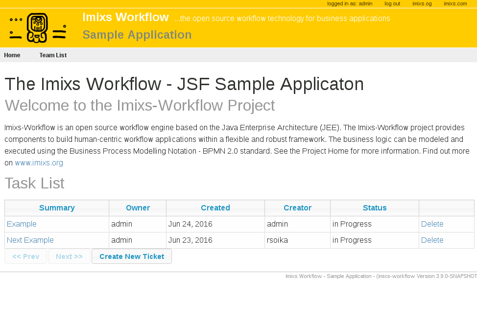

# Imixs-Workflow

Imixs-Workflow is an open source workflow engine based on the Java Enterprise Architecture (JEE). The Imixs-Workflow project provides components to build human-centric workflow applications within a flexible and robust framework. The business logic can be modeled and executed using the Business Process Modelling Notation - BPMN 2.0 standard. 

To follow us in this project, please join GitHub by [creating an account](https://github.com/join). You can than "Watch" the project with the link above or if you like the project click on the "Star". 

You will find more detailed information how to work with Imixs-Workflow on the [Project Home](http://www.imixs.org). 

## Imixs-BPMN
Imixs-BPMN is an Eclipse modeling tool to design a business process based on the BPMN 2.0 standard. These models can be executed by the Imixs-Workflow engine. 

Read more about Imixs-BPMN on the [project home](http://www.imixs.org/modeler/). 

## Imixs-RESTful API
Imixs-Workflow provides a RESTful API to integrate the Imixs-Workflow engine into a microservice architecture. In such an architecture the Imixs-Workflow engine can be deployed as a separate microservice managing human-centric workflow tasks. The Imixs-Microservice project also includes a Docker Container to setup the workflow engine in a few minutes. See the [Imixs-Microservice project](https://github.com/imixs/imixs-microservice) for more information.

## How to Build
Imixs-Workflow can be build with Maven. All artifacts are provided in the [maven central repository](http://search.maven.org/#browse).

This is an example how to add imixs-workflow into the dependencies of your own maven project:

	<dependencies> 
	   .....
		<!-- Imixs Workflow -->
		<dependency>
			<groupId>org.imixs.workflow</groupId>
			<artifactId>imixs-workflow-engine</artifactId>
			<version>${org.imixs.workflow.version}</version>
		</dependency>
		<dependency>
			<groupId>org.imixs.workflow</groupId>
			<artifactId>imixs-workflow-jax-rs</artifactId>
			<version>${org.imixs.workflow.version}</version>
		</dependency>
		<dependency>
			<groupId>org.imixs.workflow</groupId>
			<artifactId>imixs-workflow-faces</artifactId>
			<version>${org.imixs.workflow.version}</version>
		</dependency>
	</dependencies>
	...

To build form the source code run:

	mvn install

Prerequisites:

* JDK8+
* Maven 3.0.3+
* Java EE Application Server

## The Sample Application

The [Imixs-Workflow Sample Application](https://github.com/imixs/imixs-jsf-example) demonstrates the Imixs-Workflow engine embedded into a simple JSF Web Application. The Sample Application can be used as a scaffold for custom projects.

## Docker

The Imixs-Workflow engine is also available as a Docker Image running Imixs-Workflow as a microservice. Find out more on the [Imixs-Microservice project](https://github.com/imixs/imixs-microservice).

## Joining the Project

If you have any questions post them into the [issue tracker](https://github.com/imixs/imixs-workflow/issues).
If you have a bug or an idea, browse the [open issues](https://github.com/imixs/imixs-workflow/issues) before opening a new one. You can also take a look at the [Open Source Guide](https://opensource.guide/).

## License

Imixs-Workflow is free software, because we believe that an open exchange of experiences is fundamental for the development of valuable software. All results of this project are provided under the [GNU General Public License](http://www.gnu.org/licenses/gpl-3.0.en.html). 

Since in the typical use cases the Imixs-Workflow engine runs as a separate process, embedded into an application which is probably a separate work, we do not see any violation of the GPL. Feel free to ask for your concrete use case. 
