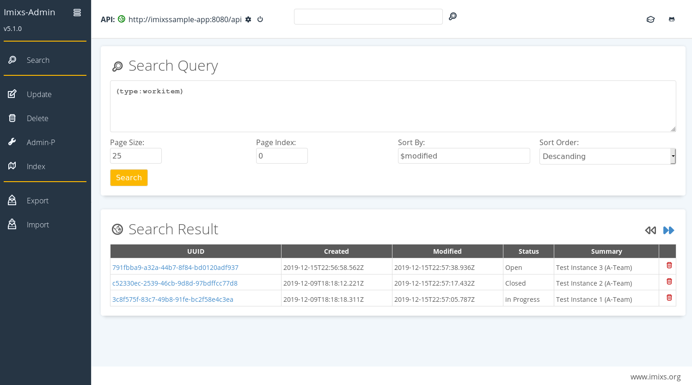

# Imixs-Workflow

Imixs-Workflow is an open source workflow engine to build human-centric workflow applications on a flexible and robust framework. 
Using the Business Process Modelling Notation - BPMN 2.0, business logic can be modeled fast, easy and in a flexible way. 
Imixs-Workflow is based on the [Jarkarta EE](https://jakarta.ee/) and the [Eclipse Microprofile](https://microprofile.io/) standards and fits into any modern microservice architecture thanks to its openness. Imixs-Workflow runs on all modern application servers like [Wildfly](https://wildfly.org/), [Payara](https://www.payara.fish/), [Open Liberty](https://openliberty.io/) or [Apache TomEE](http://tomee.apache.org/).

To follow us, please join GitHub by [creating an account](https://github.com/join). You can than "Watch" the project with the link above or if you like the project click on the "Star". 

You will find more detailed information how to work with Imixs-Workflow on the [Project Home](http://www.imixs.org). 

**Imixs-Worflow has full Jakarta EE 9 support!**  This means you can run Imixs-Workflow on every modern application server supporting Jakarata EE 9. 

If you want to run Imixs-Workflow on Jakarta EE 8 you can use version 5.2. This version is still fully supported!

## Imixs-BPMN
Imixs-BPMN is an Eclipse modeling tool to design a business process based on the BPMN 2.0 standard. These models can be executed by the Imixs-Workflow engine. 

Read more about Imixs-BPMN on the [project home](https://www.imixs.org/sub_modeler.html). 

## Imixs-RESTful API
Imixs-Workflow provides a RESTful API to integrate the Imixs-Workflow engine into a microservice architecture. In such an architecture the Imixs-Workflow engine can be deployed as a separate microservice managing human-centric workflow tasks. See the [Imixs-Microservice project](https://github.com/imixs/imixs-microservice) for more information.

## How to Build
Imixs-Workflow can be build with Maven. All artifacts are provided in the [maven central repository](http://search.maven.org/#browse).
See the following example how to add imixs-workflow to your own maven project:

	<dependencies> 
	   .....
		<dependency>
			<groupId>org.imixs.workflow</groupId>
			<artifactId>imixs-workflow-engine</artifactId>
			<version>${org.imixs.workflow.version}</version>
		</dependency>
		<dependency>
			<groupId>org.imixs.workflow</groupId>
			<artifactId>imixs-workflow-jax-rs</artifactId>
			<version>${org.imixs.workflow.version}</version>
		</dependency>
		<dependency>
			<groupId>org.imixs.workflow</groupId>
			<artifactId>imixs-workflow-index-lucene</artifactId>
			<version>${org.imixs.workflow.version}</version>
		</dependency>
	...

To build Imixs-Workflow form the source code run:

	mvn install

Prerequisites:

* JDK8+
* Maven 3.0.3+
* Jakarta EE Application Server

## Imixs-Admin

The [Imixs-Admin project](https://github.com/imixs/imixs-admin) provides a web based tool to administrate an Imixs-Workflow instance remotely.

## The Imixs Process Manager

The [Imixs Process Manger](https://github.com/imixs/imixs-process-manager) allows you to start within seconds.
The integrated Business Process Management Suite can be used for development, testing and productive environments. It provides you with a generic user interface which can be easily adapted. 

 

The Imixs Process Manager comes with a Docker image that can be deployed locally or in a containerized environment like Docker Swarm or Kubernetes. 
Download the [docker-compose.yml](https://raw.githubusercontent.com/imixs/imixs-process-manager/master/docker-compose.yml) file and run:

	$ docker-compose up

## Microservice

The [Imixs-Microservice project](https://github.com/imixs/imixs-microservice) provides a full service stack for a microservice architecture running on Kubernetes or Docker-Swarm. Find out more on [Docker hub](https://hub.docker.com/r/imixs/imixs-microservice).

## Joining the Project

If you have any questions post them into the [issue tracker](https://github.com/imixs/imixs-workflow/issues).
If you have a bug or an idea, browse the [open issues](https://github.com/imixs/imixs-workflow/issues) before opening a new one. You can also take a look at the [Open Source Guide](https://opensource.guide/).

## License

Imixs-Workflow is free software, because we believe that an open exchange of experiences is fundamental for the development of valuable software. All results of this project are provided under the [GNU General Public License](http://www.gnu.org/licenses/gpl-3.0.en.html). 

Since in the typical use cases the Imixs-Workflow engine runs as a separate process, embedded into an application which is probably a separate work, we do not see any violation of the GPL. Feel free to ask for your concrete use case. 
